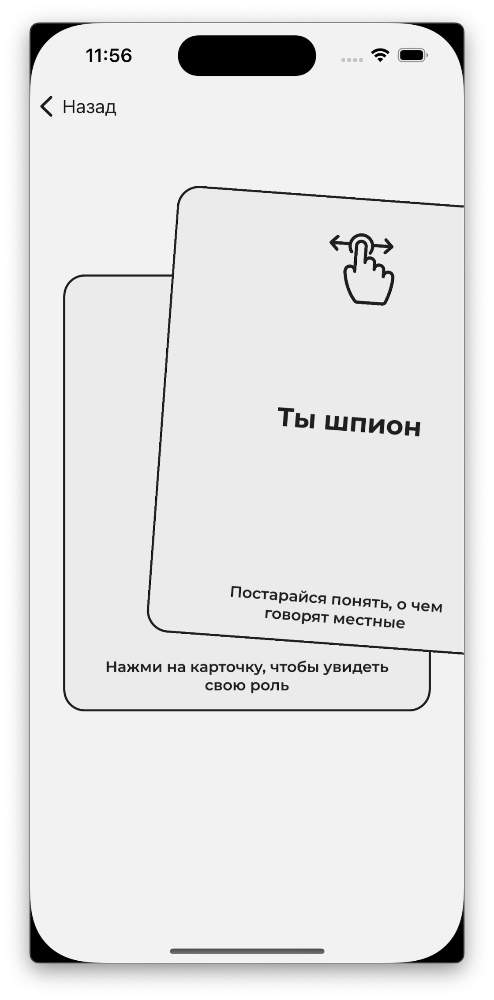

## Description
It`s just an offline game for your company
## Technology stack
* UIKit
* Combine
## Build & run
1. Clone this project
2. Run `make gen` and `make start`
3. Build and run project
## Screenshots

## Developers
[Andrew Firsenko](https://t.me/andrewfirsenko) 
[Ilya Gavrilov](https://t.me/llxodz) 

